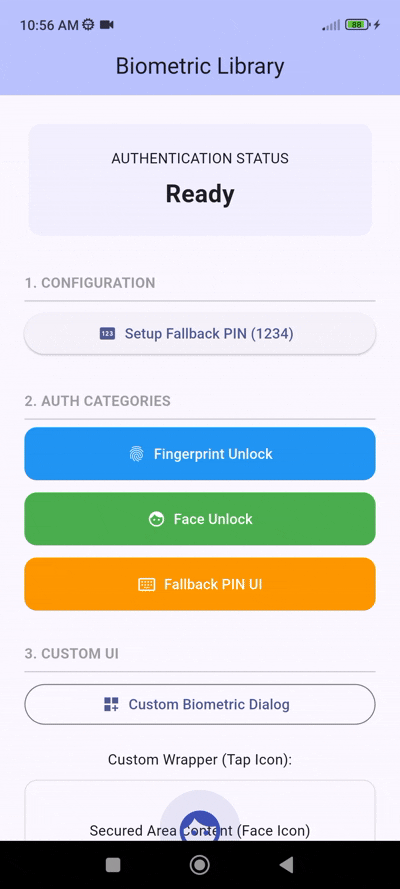

# Flutter Biometric Auth Library

A powerful and easy-to-use Flutter package that provides a comprehensive biometric authentication solution with support for Fingerprint, Face Unlock, and a secure Fallback PIN UI. Protect your app's sensitive areas with industry-standard security and a polished user experience.

Easily implement security features with support for:

*   **Fingerprint & Face Unlock**: Seamless integration with device biometric sensors.
*   **Fallback PIN UI**: A secure, customizable PIN entry system that activates when biometrics are unavailable or fail.
*   **Custom Biometric Dialog**: Branded pre-authentication dialogs to guide your users.
*   **Secure Storage**: Encrypted PIN storage using `flutter_secure_storage` (KeyStore/Keychain).
*   **Orchestration**: A unified manager that handles the complex flow between biometrics and PIN fallback automatically.
*   **Modular Design**: Optimized for performance and clean architecture.

## Features

✅ **Fingerprint Unlock**: Standard fingerprint authentication support.
✅ **Face Unlock**: Detection and support for Face ID and 2D Face Unlock.
✅ **Fallback PIN UI**: Customizable 4-digit (or more) PIN entry with haptic feedback.
✅ **Secure Storage**: PINs are never stored in plain text; they use hardware-backed encryption.
✅ **Customizable Wrappers**: Build your own UI triggers using `BiometricAuthWrapper`.
✅ **Platform Support**: Fully optimized for Android and iOS.

## Preview


## Installation

Add the package to your `pubspec.yaml`:

```yaml
dependencies:
  flutter_biometric_auth_library:
    path: https://github.com/Excelsior-Technologies-Community/flutter_biometric_auth_library/tree/stagies
```

## Android Configuration

Ensure your `MainActivity.kt` extends `FlutterFragmentActivity`:

```kotlin
import io.flutter.embedding.android.FlutterFragmentActivity

class MainActivity: FlutterFragmentActivity()
```

Add the biometric permission to your `AndroidManifest.xml`:

```xml
<uses-permission android:name="android.permission.USE_BIOMETRIC"/>
```

## Basic Usage

### Initialize the Manager
The `BiometricAuthManager` is the easiest way to handle the full authentication flow.

```dart
final authManager = BiometricAuthManager();
```

### Setup a Fallback PIN
Before using the fallback UI, ensure a PIN is set.

```dart
final pinService = PinAuthService();
await pinService.setPin('1234');
```

### Authenticate with Fallback
Trigger the full biometric -> PIN flow.

```dart
final result = await authManager.authenticate(
  context,
  localizedReason: 'Please authenticate to access the vault',
  pinDescription: 'Enter your 4-digit security PIN',
);

if (result == AuthResult.success) {
  print("Access Granted!");
}
```

### Show Custom Biometric Dialog
```dart
await CustomBiometricDialog.show(
  context,
  title: 'Secure Access',
  description: 'Authentication is required to view this content.',
  authenticateAction: () async {
    final res = await authManager.authenticate(context, localizedReason: 'Access');
    return res == AuthResult.success;
  },
);
```

## Full Example

```dart
import 'package:flutter/material.dart';
import 'package:flutter_biometric_auth_library/flutter_biometric_auth_library.dart';

void main() => runApp(const MyApp());

class MyApp extends StatelessWidget {
  const MyApp({super.key});

  @override
  Widget build(BuildContext context) {
    return MaterialApp(home: const SecurityHome());
  }
}

class SecurityHome extends StatefulWidget {
  const SecurityHome({super.key});

  @override
  State<SecurityHome> createState() => _SecurityHomeState();
}

class _SecurityHomeState extends State<SecurityHome> {
  final _authManager = BiometricAuthManager();
  final _pinService = PinAuthService();
  String _status = 'Locked';

  Future<void> _unlock() async {
    // Ensure PIN is set for fallback
    if (!await _pinService.isPinSet()) {
       await _pinService.setPin('1234');
    }

    final result = await _authManager.authenticate(
      context,
      localizedReason: 'Unlock App',
    );

    if (result == AuthResult.success) {
      setState(() => _status = 'Unlocked');
    }
  }

  @override
  Widget build(BuildContext context) {
    return Scaffold(
      appBar: AppBar(title: const Text('Biometric Library')),
      body: Center(
        child: Column(
          mainAxisAlignment: MainAxisAlignment.center,
          children: [
            Text('Status: $_status'),
            ElevatedButton(
              onPressed: _unlock,
              child: const Text('Unlock with Biometrics/PIN'),
            ),
          ],
        ),
      ),
    );
  }
}
```

## Available APIs

| Method / Class | Type | Description |
| :--- | :--- | :--- |
| `BiometricAuthManager.authenticate()` | `Future<AuthResult>` | Orchestrates Biometric -> PIN fallback flow. |
| `PinAuthService.setPin(pin)` | `Future<void>` | Securely saves a new PIN. |
| `PinAuthService.verifyPin(pin)` | `Future<bool>` | Verifies input against stored PIN. |
| `BiometricAuthWrapper` | `Widget` | A widget that wraps content and triggers auth on tap. |
| `CustomBiometricDialog.show()` | `Future<bool?>` | Shows a branded pre-authentication dialog. |

## License

MIT License

Copyright (c) 2026 Excelsior Technologies

Permission is hereby granted, free of charge, to any person obtaining a copy of this software and associated documentation files (the "Software"), to deal in the Software without restriction, including without limitation the rights to use, copy, modify, merge, publish, distribute, sublicense, and/or sell copies of the Software, and to permit persons to whom the Software is furnished to do so, subject to the following conditions:

The above copyright notice and this permission notice shall be included in all copies or substantial portions of the Software.

THE SOFTWARE IS PROVIDED "AS IS", WITHOUT WARRANTY OF ANY KIND, EXPRESS OR IMPLIED, INCLUDING BUT NOT LIMITED TO THE WARRANTIES OF MERCHANTABILITY, FITNESS FOR A PARTICULAR PURPOSE AND NONINFRINGEMENT. IN NO EVENT SHALL THE AUTHORS OR COPYRIGHT HOLDERS BE LIABLE FOR ANY CLAIM, DAMAGES OR OTHER LIABILITY, WHETHER IN AN ACTION OF CONTRACT, TORT OR OTHERWISE, ARISING FROM, OUT OF OR IN CONNECTION WITH THE SOFTWARE OR THE USE OR OTHER DEALINGS IN THE SOFTWARE.
